<p align="center">
  
</p>

<p align="center">
  
</p>

<p align="center">
  
  
  
  
</p>

<p align="center">
  <a href="https://linkedin.com/in/debosmitasarkar-652632213"></a>
  <a href="https://debosmitasarkar2003.github.io/debosmita-sarkar-portfolio/"></a>
  <a href="mailto:debosmita020803@gmail.com"></a>
</p>

<p align="center">
  
</p>

<p align="center"></p>

I'm a **Health Informatics graduate student and ML practitioner** with a background in **Computer Science**, focused on building AI systems that turn complex biomedical and clinical data into useful, explainable decisions.

My work spans **Clinical AI, Machine Learning, NLP & RAG, Bioinformatics, Data Engineering, and Health Data Analytics**, from signal processing and feature engineering through modeling, explainability, and deployment.

Recent work:

- 🧠 **Multimodal Epilepsy Prediction**: late fusion of EEG and lifestyle biomarkers, presented at the DePaul CDM Research Symposium 2026.
- 🧬 **Anti-Cancer Peptide Prediction**: a deep MLP for peptide classification, published at ICICCT 2024.
- 🏭 **Zoetis Operations Automation**: a scheduling automation tool for a GMP-regulated pharmaceutical manufacturing team.

A recurring focus in my work is **explainable health AI**: models that show *why* they predict what they predict, using tools like SHAP.

### 🔮 Currently Exploring
`Clinical AI` · `LLM Applications` · `RAG Systems` · `Agentic AI` · `MLOps` · `FHIR Interoperability`

### 🌸 Open To
`Data Science` · `Health Informatics` · `Clinical AI / ML Engineering` · `Healthcare Analytics` · `Product Management`

<p align="center"></p>

### Languages & Data


### Machine Learning & Deep Learning


-A21CAF?style=flat-square)

### Generative AI & NLP


### Health Informatics & Bioinformatics


### Data Engineering & Cloud


### Analytics & Visualization


### Tools


<p align="center">
  
</p>

<p align="center"></p>

### 🧠 Multimodal Epilepsy Prediction

> **Late fusion of EEG signals and lifestyle biomarkers to classify seizure activity and predict seizure frequency.**

| | |
|---|---|
| **Core Stack** | R • XGBoost • Logistic Regression • SVM |
| **Data** | EEG Signals • Lifestyle & Clinical Variables |
| **Approach** | Late Fusion • Classification + Regression |
| **Explainability** | SHAP |
| **Results** | 93.8% accuracy • AUC-ROC 0.967 |
| **Venue** | DePaul CDM Research Symposium 2026 (poster) |
| **Repository** | [View on GitHub](https://github.com/DebosmitaSarkar2003/Multimodal-Epilepsy-Prediction-Using-EEG-and-Lifestyle-Data) |

```
EEG Signals              Lifestyle / Clinical Data
     ↓                              ↓
Signal Features             Tabular Features
          ↘                      ↙
               Late Fusion
                    ↓
          XGBoost · LR · SVM
                    ↓
 Seizure Classification + Frequency Prediction
                    ↓
           SHAP Explainability
```

### 🧬 Anti-Cancer Peptide Prediction

> **A deep MLP that identifies anti-cancer peptides from biological sequences. Published at ICICCT 2024.**

| | |
|---|---|
| **Core Stack** | Python • Scikit-learn • MLP (6 hidden layers) |
| **Features** | Binary Profile Features • AAindex Descriptors |
| **Feature Selection** | mRMR • NAO |
| **Data** | ACP740 • ACP240 |
| **Results** | 88.33% accuracy on ACP740 |
| **Repository** | [View on GitHub](https://github.com/DebosmitaSarkar2003/Anti-Cancer-Peptide-Prediction-Model-Major-Project-) |

```
Peptide Sequences
        ↓
Feature Encoding (BPF + AAindex)
        ↓
Feature Selection (mRMR / NAO)
        ↓
Data Augmentation
        ↓
6-Layer MLP Classifier
        ↓
ACP / Non-ACP Prediction
```

### 🏥 AI Hospital Management Chatbot

> **A RAG-powered assistant that answers hospital questions with context retrieved from hospital information and doctor schedules.**

| | |
|---|---|
| **Core Stack** | Python • LangChain • Streamlit |
| **Retrieval** | FAISS • HuggingFace Embeddings |
| **Approach** | Retrieval-Augmented Generation |
| **Repository** | [View on GitHub](https://github.com/DebosmitaSarkar2003/AI-BASED-CHATBOT-MODEL-FOR-HOSPITAL-MANAGEMENT) |

```
Hospital Documents
        ↓
HuggingFace Embeddings
        ↓
FAISS Vector Index
        ↓
User Question → Retrieve Context
        ↓
LLM Response via LangChain
        ↓
Streamlit Interface
```

### 🌷 More Projects

| Project | Highlights |
|---|---|
| [Blood-Brain Barrier Peptides](https://github.com/DebosmitaSarkar2003/Blood-Brain-Barrier-Peptide-Prediction-Model) | CNN–SVM hybrid for targeted drug delivery research |
| [Breast Cancer Detection](https://github.com/DebosmitaSarkar2003/Breast-Cancer-Detection-) | RF, SVM & neural nets with SHAP for oncology decision support |
| [Early Autism Detection](https://github.com/DebosmitaSarkar2003/Early-Detection-of-Autism-in-Human-Population) | Interpretable classifiers on behavioral & clinical features |
| [Opioid Crisis Determinants](https://github.com/DebosmitaSarkar2003/Socioeconomic-Determinants-of-the-Opioid-Crisis) | Regression analysis of socioeconomic drivers in R |
| [DataFest 2025](https://github.com/DebosmitaSarkar2003/DataFest-Hackathon-2025-Loyala) | ASA DataFest hackathon at Loyola University Chicago |

<p align="center"></p>

### ABI Intern — Zoetis
**Jun 2026 — Sep 2026 · Lincoln, NE**

- Built an operations automation tool for manufacturing scheduling in a GMP-regulated pharmaceutical environment.
- Worked across Power Apps, Power Automate, SharePoint, and Power BI alongside SAP, Excel, and Python optimization logic deployed via Azure Functions.
- Translated cross-functional business requirements into a low-code + code hybrid build.

`Power Platform` `Python` `Azure Functions` `SAP` `Process Automation`

### Graduate Ambassador — DePaul Jarvis College of Computing & Digital Media
**Jan 2026 — Present · Chicago, IL**

- Mentor prospective MS students on the Health Informatics curriculum and graduate life.
- Support admissions with recruitment events and enrollment.

`Mentorship` `Communication` `Stakeholder Engagement`

### Full Stack Engineer — Taavie
**Jun 2024 — Dec 2024 · Remote**

- Engineered an AI-driven e-commerce platform with custom ML recommendation systems.
- Built interactive KPI dashboards and optimized full-stack performance for scalable deployment.

`Machine Learning` `Recommender Systems` `Full Stack` `Dashboards`

### Software Developer Intern — Steel Authority of India Limited (SAIL)
**May 2023 — Dec 2023 · Ranchi, India**

- Built a BERT-based NLP review summarization system for large-scale text analysis.
- Developed a context-aware conversational AI chatbot integrated into production.

`BERT` `NLP` `Conversational AI` `Python`

### Convenor, Women Empowerment Club — SRMIST
**Sep 2022 — Aug 2024 · Chennai, India**

- Led gender equity workshops and events; directed 50+ student volunteers. Received the Convenor Award twice.

`Leadership` `Event Management` `DEI in STEM`

<p align="center"></p>

### DePaul University — Chicago, IL
**Master of Science in Health Informatics** · Jan 2025 — Nov 2026

`Clinical AI & Decision Support` `EHR Systems (Epic)` `FHIR / HL7` `Health Data Analytics` `Biostatistics` `MLOps` `HIPAA & Data Governance`

### SRM Institute of Science and Technology — Chennai, India
**Bachelor of Technology in Computer Science & Engineering** · 2020 — 2024

`Machine Learning` `Databases` `Cloud Computing` `Data Structures & Algorithms` `Software Engineering`

<p align="center"></p>

```yaml
learning:
  - LLM Fine-Tuning
  - Agentic AI Systems
  - MLOps
  - FHIR Interoperability

building:
  - Explainable Clinical AI Models
  - Health Data Pipelines
  - RAG-Powered Healthcare Assistants

open_to:
  - Data Science
  - Health Informatics
  - Clinical AI / ML Engineering
  - Healthcare Analytics
  - Product Management
```

<p align="center"></p>

<p align="center">
  <a href="mailto:debosmita020803@gmail.com"></a>
  <a href="https://linkedin.com/in/debosmitasarkar-652632213"></a>
  <a href="https://debosmitasarkar2003.github.io/debosmita-sarkar-portfolio/"></a>
</p>

<p align="center">
  
</p>

<p align="center">
  
</p>
